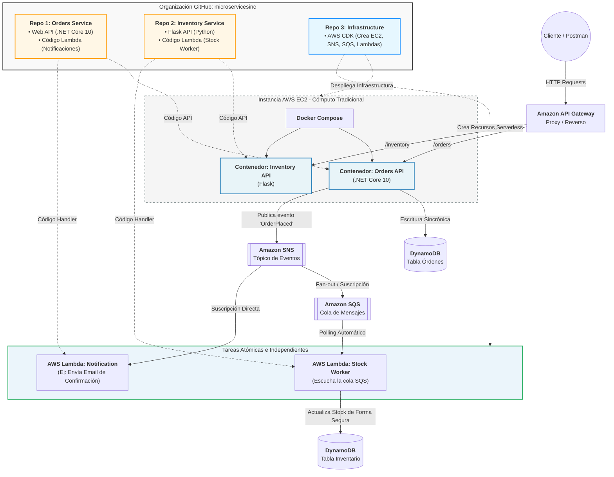

# Microservices Architecture Lab - Showcase 🚀

Este espacio ha sido diseñado para demostrar la implementación de una arquitectura híbrida de microservicios, combinando cómputo tradicional en contenedores con un diseño moderno **Serverless orientado a eventos**. 

El ecosistema simula un caso de uso común de negocio: **Gestión de Órdenes de Compra e Inventario**, priorizando el desacoplamiento, la resiliencia y la escalabilidad automática de componentes específicos.

---

## 🎯 Intención del Proyecto

El objetivo principal es resolver el problema del acoplamiento temporal entre servicios críticos mediante mensajería asíncrona. 

1. **Cómputo Core Estable:** Las APIs principales de negocio corren sobre contenedores tradicionales dentro de una infraestructura dedicada (**AWS EC2**), asegurando latencias predecibles.
2. **Operaciones Atómicas Scalables:** Las tareas secundarias desencadenadas por el negocio (como el procesamiento de stock posterior a una venta) se delegan a funciones **AWS Lambda**, eliminando carga computacional de los servidores principales y optimizando costos.
3. **Punto de Entrada Unificado:** Toda la comunicación externa con los clientes se gestiona a través de una capa de API Gateway, abstrayendo la topología interna de la red.

---

## 🗺️ Roadmap de Implementación

El proyecto se ejecuta de forma incremental a través de las siguientes fases estratégicas para asegurar la calidad del código y la automatización:

### ⚙️ Fase 1: Simulación y Desarrollo Local
* **Objetivo:** Construir la lógica de negocio a costo cero y validar el comportamiento reactivo antes de ir a producción.
* **Tecnologías:** Docker, Docker Compose, LocalStack (emulación local de DynamoDB, SNS y SQS) y Nginx (como API Gateway local).
* **Entregable:** Un flujo local verificado vía Postman donde el servicio de Órdenes (.NET Core 10) publica eventos que impactan al servicio de Inventario (Python/Flask) sin conexión HTTP directa.

### 📜 Fase 2: Infraestructura como Código (IaC)
* **Objetivo:** Automatizar la creación de todo el entorno cloud real para evitar configuraciones manuales propensas a errores.
* **Tecnologías:** AWS CDK (Cloud Development Kit).
* **Entregable:** Scripts declarativos en el repositorio de infraestructura que aprovisionan bases de datos NoSQL (DynamoDB), la VPC de red, servidores EC2, tópicos/colas (SNS/SQS) y el mapeo de eventos hacia la AWS Lambda.

### ☁️ Fase 3: Despliegue Cloud y Showcase Técnico
* **Objetivo:** Migrar la arquitectura verificada a un entorno real productivo utilizando créditos de capa gratuita de AWS.
* **Tecnologías:** Amazon API Gateway, AWS EC2, Amazon DynamoDB, AWS Lambda.
* **Entregable:** Demostración de punta a punta con URLs públicas de AWS Gateway, monitoreo de colas y persistencia NoSQL de baja latencia en vivo.

---

## 📂 Estructura de Repositorios

* **`orders-service`**: Microservicio encargado del ciclo de vida de las compras (.NET Core 10).
* **`inventory-service`**: Microservicio que gestiona el stock de productos (Python/Flask) y aloja el código de la Lambda atómica.
* **`infrastructure`**: Código fuente de AWS CDK para el despliegue automatizado de la arquitectura en la nube.

## Diseño 

