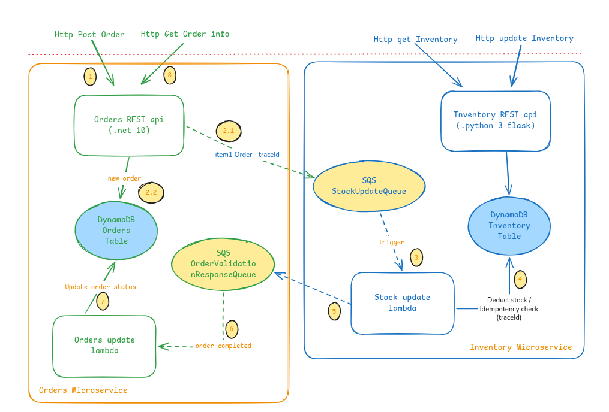

# Microservices Architecture Lab 🚀

Este espacio ha sido diseñado para demostrar la implementación de una arquitectura híbrida de microservicios, combinando cómputo tradicional en contenedores con un diseño moderno **Serverless orientado a eventos**. 

El ecosistema simula un caso de uso común de negocio: **Gestión de Órdenes de Compra e Inventario**, priorizando el desacoplamiento, la resiliencia y la escalabilidad automática de componentes específicos.

---

## 🎯 Intención del Proyecto

El objetivo principal es resolver el problema del acoplamiento temporal entre servicios críticos mediante mensajería asíncrona. 

1. **Cómputo Core Estable:** Las APIs principales de negocio corren sobre contenedores tradicionales dentro de una infraestructura dedicada (**AWS EC2**), asegurando latencias predecibles.
2. **Operaciones Atómicas Scalables:** Las tareas secundarias desencadenadas por el negocio (como el procesamiento de stock posterior a una venta) se delegan a funciones **AWS Lambda**, eliminando carga computacional de los servidores principales y optimizando costos.
3. **Punto de Entrada Unificado:** Toda la comunicación externa con los clientes se gestiona a través de una capa de API Gateway, abstrayendo la topología interna de la red.

---

## Diseño 

El diseño de este sistema se puede ver en el siguiente diagrama de interacción. Algunas características:

* **Políglota**: Dominio de Órdenes en .NET 10 y el de Inventario en Python 3/Flask. Cada microservicio usa su propia base de datos NoSQL (DynamoDB) e infraestructura independiente.
* **Patrón Saga basada en Coreografía**: Cero orquestadores centrales. Los servicios hablan tirando eventos asíncronos a colas AWS SQS (StockUpdateQueue y OrderValidationResponseQueue).
* **Consistencia Eventual**: Al ser asíncrono, la orden se guarda rápido como PENDING (Paso 2.2). El estado final se estabiliza a APPROVED (Paso 7) en milisegundos tras vaciarse las colas.
* **Idempotencia con traceId (🛡️)**: SQS estándar puede duplicar mensajes. Pasamos un traceId (Correlation ID) en el payload para que la Lambda de Python valide que no descuente stock dos veces.
* **CQRS Integrado**: El cliente muta el sistema con comandos (POST Order) y consulta estados con un canal de lectura ultraligero (GET Order info).

---

## 🗺️ Roadmap de Implementación

El proyecto se ejecuta de forma incremental a través de las siguientes fases estratégicas para asegurar la calidad del código y la automatización:

### ⚙️ Fase 1: Simulación y Desarrollo Local
* **Objetivo:** Construir la lógica de negocio a costo cero y validar el comportamiento reactivo antes de ir a producción.
* **Tecnologías:** Docker, Docker Compose, LocalStack (emulación local de DynamoDB, SNS y SQS) y Nginx (como API Gateway local).
* **Entregable:** Un flujo local verificado vía Postman donde el servicio de Órdenes (.NET Core 10) publica eventos que impactan al servicio de Inventario (Python/Flask) sin conexión HTTP directa.

### 📜 Fase 2: Infraestructura como Código (IaC)
* **Objetivo:** Automatizar la creación de todo el entorno cloud real para evitar configuraciones manuales propensas a errores.
* **Tecnologías:** AWS CDK (Cloud Development Kit).
* **Entregable:** Scripts declarativos en el repositorio de infraestructura que aprovisionan bases de datos NoSQL (DynamoDB), la VPC de red, servidores EC2, tópicos/colas (SNS/SQS) y el mapeo de eventos hacia la AWS Lambda.

### ☁️ Fase 3: Despliegue Cloud y Showcase Técnico
* **Objetivo:** Migrar la arquitectura verificada a un entorno real productivo utilizando créditos de capa gratuita de AWS.
* **Tecnologías:** Amazon API Gateway, AWS EC2, Amazon DynamoDB, AWS Lambda.
* **Entregable:** Demostración de punta a punta con URLs públicas de AWS Gateway, monitoreo de colas y persistencia NoSQL de baja latencia en vivo.

---

## 📂 Estructura de Repositorios

* **`orders-service`**: Microservicio encargado del ciclo de vida de las compras (.NET Core 10).
* **`inventory-service`**: Microservicio que gestiona el stock de productos (Python/Flask) y aloja el código de la Lambda atómica.
* **`infrastructure`**: Código fuente de AWS CDK para el despliegue automatizado de la arquitectura en la nube.

# Mejoras y Futuros Cambios de Arquitectura

Este documento detalla la hoja de ruta técnica para elevar los niveles de escalabilidad, desacoplamiento y resiliencia del ecosistema de microservicios, transitando desde nuestro modelo actual hacia patrones distribuidos avanzados.

---

## 📢 Evolución de la Comunicación Orientada a Eventos

### 1. Implementación del Patrón SNS-to-SQS Fan-out
Actualmente, el servicio de Órdenes se comunica de forma directa punto a punto con la cola de Inventario. Para permitir que el ecosistema crezca de forma orgánica sin modificar el servicio emisor, escalaremos la mensajería al patrón **Fan-out**.

*   **Mecánica del Cambio:** El microservicio de Órdenes dejará de publicar directamente en `StockUpdateQueue`. En su lugar, publicará un único evento genérico (`OrderCreated`) en un tópico de **Amazon SNS**.
*   **Suscripción por Colas:** La cola actual de Inventario (`StockUpdateQueue`) se suscribirá a dicho tópico de SNS. Si en el futuro el negocio requiere agregar nuevos microservicios (como un servicio de *Notificaciones* o *Auditoría*), bastará con crearles su propia cola SQS y suscribirla al mismo tópico de SNS.
*   **Beneficio Arquitectónico:** Logramos un desacoplamiento total de tipo *1-a-N*. Mantenemos el beneficio de **Queue-Based Load Leveling** (nivelación de carga y amortiguación de hilos) de SQS para cada worker, pero ganamos la flexibilidad de que múltiples servicios reaccionen al mismo evento de negocio de forma independiente.

### 2. Transición hacia Amazon EventBridge (Event Bus)
Como evolución definitiva hacia una arquitectura reactiva empresarial de nivel *Élite*, se proyecta la migración del transporte de mensajería hacia **Amazon EventBridge**.

*   **Enrutamiento Inteligente por Contenido:** Eliminaremos la necesidad de gestionar múltiples tópicos rígidos de SNS. Centralizaremos toda la comunicación en un único **Bus de Eventos (Event Bus)** customizado. EventBridge evaluará el JSON de los eventos en tiempo real mediante *Reglas de Filtrado*, enviando los payloads a las Lambdas o colas correspondientes basándose estrictamente en los atributos del mensaje.
*   **Schema Registry (Contratos Fuertemente Tipados):** Utilizaremos el Registro de Esquemas nativo de EventBridge para asegurar que los cambios en la estructura de los JSON (enviados por ejemplo desde Python) no rompan las aplicaciones consumidoras (.NET 10). Esto nos permitirá descargar esquemas y generar clases fuertemente tipadas en tiempo de compilación.
*   **Integración SaaS Directa:** Habilitará la capacidad de capturar eventos de proveedores externos de la industria (como pasarelas de pago tipo Stripe o Auth0) directamente en nuestro Bus de Eventos sin necesidad de programar, asegurar ni mantener Webhooks intermedios en nuestras APIs principales.

