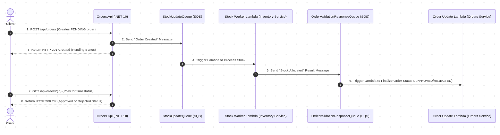

# 🚀 Event-Driven Ecosystem: Dev & SRE Roadmap

## Phase 1: Core Choreographed Saga Loop & Basic Distributed Tracing
* **Focus:** Establishing bi-directional async consistency and end-to-end trace visibility for a two-service transaction loop.
* **Core Architecture Pattern:** Asynchronous Saga Choreography (Two-Way Handshake)

### 💻 Development Track
- [x] **Orders Microservice:** Created .NET 10 Minimal API with clean architecture.
- [x] **Orders Microservice:** Configured DynamoDB `Orders` table persistence via repository pattern.
- [x] **Orders Microservice:** Dispatched outbound transaction message to `StockUpdateQueue`.
- [x] **Inventory Microservice:** Created Python 3.11 Flask API with baseline database logic.
- [x] **Inventory Microservice:** Wired an AWS Lambda to consume from `StockUpdateQueue` and process stock allocation.
- [ ] **Inventory Microservice:** Add outbound logic to push a transaction completion result (`StockReservedSuccessfully` or `StockAllocationFailed`) to a new `OrderValidationResponseQueue`.
- [ ] **Orders Microservice:** Implement a dedicated `Order Update Lambda` that listens to `OrderValidationResponseQueue` and flips the target DynamoDB record state from `PENDING` to `APPROVED` or `REJECTED`.

### 🛠️ SRE Track
- [x] **Local Environment Setup:** Positioned central LocalStack Engine on port `4566` with persistent volumes and explicit Docker network bridging (`dev_cloud_network`).
- [x] **Kernel OS Tuning:** Expanded system watch parameters permanently via `fs.inotify.max_user_instances=512`.
- [ ] **Telemetry Infrastructure:** Introduce a **Jaeger** container alongside LocalStack in your shared `org-infrastructure-repo/docker/local-dev/docker-compose.yml`.
- [ ] **Instrumentation (.NET 10):** Configure native `System.Diagnostics.Activity` within `Orders.Application` handlers to automatically capture execution span metadata and forward it via OpenTelemetry (OTLP) to Jaeger.
- [ ] **Instrumentation (Python):** Inject the `opentelemetry-sdk` into the Inventory execution path, extract incoming SQS metadata headers, and sew the distributed spans into the exact same W3C TraceContext trace payload.

---

## Phase 2: Edge Routing, API Gateway, & SRE Performance Baselines
* **Focus:** Introducing a single entry point for clients using AWS API Gateway on LocalStack to abstract backend server routes.
* **Core Architecture Pattern:** API Gateway / Reverse Proxy Pattern

### 💻 Development Track
- [ ] **Gateway Infrastructure:** Update CDK configurations to provision an **AWS API Gateway** (v2 HTTP or REST API) running on LocalStack.
- [ ] **Route Mapping:** Route incoming gateway paths (`/api/orders/*`) directly to the underlying `Orders.Api` container inside the Docker network.
- [ ] **Client Refactoring:** Point client network requests directly to the API Gateway port instead of hitting the internal port of the .NET service.

### 🛠️ SRE Track
- [ ] **Baseline Load Testing:** Set up a lightweight **K6** or **Locust** test script inside a separate container to generate simulated web traffic through the API Gateway.
- [ ] **Edge Metrics Collection:** Monitor API Gateway performance logs on LocalStack, observing execution metrics like request counts, latency spikes, and error rate percentages (4xx/5xx).

---

## Phase 3: Decoupled Multi-Consumer Fan-Out & Edge-Case Alarms
* **Focus:** Transitioning from rigid point-to-point queues to an extensible broadcast architecture without disrupting legacy code blocks.
* **Core Architecture Pattern:** Publish-Subscribe (Pub/Sub) Fan-Out via AWS SNS

### 💻 Development Track
- [ ] **Infrastructure Evolution:** Extract point-to-point messaging. Refactor the `Orders.Api` to dispatch events to an AWS **SNS Topic** (`OrderEvents`) rather than an explicit SQS queue.
- [ ] **Subscription Mapping:** Update CDK scripts to subscribe both the legacy `StockUpdateQueue` and a brand new **`NotificationQueue`** directly to the `OrderEvents` SNS topic.
- [ ] **Notification Microservice:** Scaffold a lightweight worker service (e.g., Python, Go, or Node) that reads from `NotificationQueue` and streams a human-readable confirmation slip (mock email/SMS payload) into a local Docker-mounted log or LocalStack S3 bucket.

### 🛠️ SRE Track
- [ ] **Simulated Outages & Backpressure:** Inject intentional network failures or software exceptions into your new Notification service execution loop.
- [ ] **Metric Aggregation:** Use LocalStack's CloudWatch features to track metric performance metrics like `ApproximateNumberOfMessagesVisible`.
- [ ] **SRE Alerting Alarms:** Set up local automated alerts that flag an engineering operator via logs when a queue builds up an extensive processing lag backlog.

---

## Phase 4: Financial Isolation, Dead-Letter Queues, & Redrive Mechanics
* **Focus:** Introducing a payment domain that handles sensitive third-party transaction simulations safely.
* **Core Architecture Pattern:** SQS Dead-Letter Queues (DLQs) & Idempotency Engines

### 💻 Development Track
- [ ] **Payment Microservice:** Establish a third autonomous microservice executing internal credit processing routines.
- [ ] **Ecosystem Orchestration:** Route the transaction stream so that the Payment service triggers immediately following successful inventory stock confirmation (`Inventory Table` allocation verified).
- [ ] **Idempotency Guardrails:** Inject defensive code blocks using your unique transaction `traceId` as an isolation key. Ensure that duplicate SQS deliveries never double-charge a customer account ledger.

### 🛠️ SRE Track
- [ ] **Fault-Tolerance Isolation:** Implement explicit **Dead-Letter Queues (DLQs)** with automated maximum retry limits (e.g., `maxReceiveCount = 3`) for all SQS infrastructure blocks.
- [ ] **SRE Poison Pill Playbook:** Purposefully inject an unparseable, corrupt string payload into your SQS pipeline. 
- [ ] **Recovery Exercises:** Verify that your core application avoids breaking or getting locked up, safely isolates the bad event payload inside the DLQ, and allows you to practice running an administrative redrive command script to clear the pipeline.

---

## Phase 5: Full Multi-Step Saga Compensations & Chaos Injection
* **Focus:** Mastering complex distributed failure recovery cycles and measuring edge-case data synchronization.
* **Core Architecture Pattern:** Advanced Saga Compensation Loops (Automated Rollbacks)

### 💻 Development Track
- [ ] **Shipping Microservice:** Introduce a logistics microservice that schedules delivery drivers once payment clears.
- [ ] **Compensation Pathing:** Code a deep architectural structural rollback track: if the Shipping service fails (e.g., no delivery drivers available), it must fire a `DeliveryFailed` event.
- [ ] **Automated Data Cascades:** Ensure downstream systems auto-consume the error event to trigger a chain reaction: the Payment service issues a refund event, and the Inventory service replenishes item stock counts.

### 🛠️ SRE Track
- [ ] **Chaos Engineering Exercises:** Integrate an inline network proxy like **Toxiproxy** into your shared local compose environment.
- [ ] **Latent Dependency Simulation:** Programmatically trigger a 500ms network lag penalty across service boundaries under active system load.
- [ ] **Trace Validation:** Use Jaeger to audit processing latency spikes, capture cascading systemic timeouts, and map out architectural bottlenecks.
